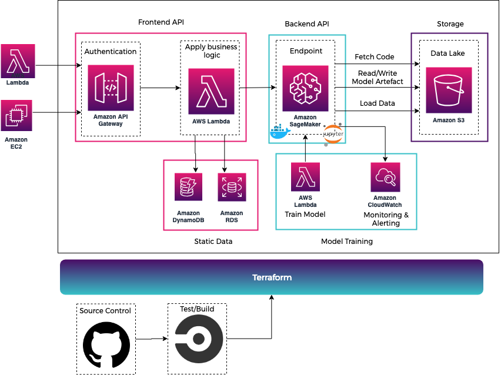

# ML Application Template

## Objective
* Build a serverless ML application in AWS that utilises a CI/CD pipeline.
* CircleCI - Test and build.
* Deploying custom Scikit Learn model inside Docker container.   

## ML Application Lifecycle

## Build

* Setup and manage notebook environment using sagemaker and docker.
* Generate and label data.
* Run Terraform.

## Train 
* Fetch Model Artefact
* Load Training Data

## Deploy
* Set up and manage inference clusters
* Provision public endpoint with API gateway

## Data Driven Architecture

